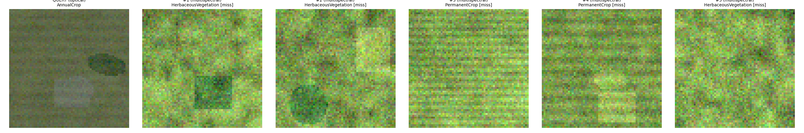

# Cross-Modal Satellite Image Retrieval

A retrieval system that accepts a **query satellite image** from one sensor
modality (optical RGB, multispectral, or SAR) and returns a **ranked list of the
most relevant images** from a gallery database containing images from the same
**or different** modalities.

The system learns a **common embedding space** where images with similar
land-cover / land-use / scene content are close together *regardless of which
sensor captured them*, then performs fast nearest-neighbour retrieval. It
reports **top-5 / top-10 (F1@K)** results and **average retrieval time per
query** for both **same-modal** and **cross-modal** retrieval.



---

## Objectives this project addresses

| Objective | How it is met |
|---|---|
| Same-modal retrieval (opt→opt, ms→ms, sar→sar) | per-modality FAISS galleries |
| Cross-modal retrieval (opt→ms, opt→sar, ms→sar, …) | shared embedding space + cross-modality search |
| Top-5 / top-10 ranking | every evaluation reports F1@5 and F1@10 |
| Multi-sensor data (≥2 aligned modalities) | optical + multispectral + SAR per patch |
| Low retrieval time | flat cosine index → ~0.2 ms / query on CPU |
| Learn a common representation space | contrastive (InfoNCE + SupCon) alignment to a shared projector |

---

## Quick start

```bash
# 1. Create and activate the virtual environment
python -m venv .venv
source .venv/Scripts/activate          # Windows (Git Bash)
# or: source .venv/bin/activate        # Linux/macOS

# 2. Install dependencies (CPU torch by default)
pip install torch torchvision --index-url https://download.pytorch.org/whl/cpu
pip install -r requirements.txt

# 3. Download / generate the dataset, train, and evaluate -- all in one go
python run_pipeline.py --config configs/default.yaml
```

The first run downloads the ImageNet-pretrained ResNet-18 backbone. The default
dataset is **fully self-contained** (no network): it is generated on the fly and
cached under `data/raw/synthetic/`.

### Individual steps

```bash
python scripts/download_data.py            # generate / download and cache the dataset
python scripts/train.py                    # train the shared-embedding model
python scripts/evaluate.py                 # run same/cross-modal retrieval evaluation
python scripts/retrieve_demo.py --pair optical,sar --k 5   # save retrieval montages
```

### Outputs

* `outputs/metrics/retrieval_metrics.csv` — F1/P/R @5 & @10 for every modality pair
* `outputs/metrics/retrieval_summary.json` — aggregate same/cross-modal averages
* `models/best_model/model.pt` — best checkpoint
* `outputs/retrieved_images/*.png` — visual montages (from `retrieve_demo.py`)

---

## Dataset

The task requires *"multi-sensor remote sensing image data consisting of two or
more aligned or semantically associated modalities."* Any dataset is selected
with `dataset.name`; real datasets are **never auto-downloaded** (see
[`docs/datasets.md`](docs/datasets.md) for download instructions, sizes and
folder layouts). Two sources work out of the box:

### 1. Synthetic multi-sensor dataset (default, works offline)

`src/data/synthetic.py` generates a paired dataset in which every patch is a
2-D land-cover scene rendered through three distinct sensor models with the
**same underlying semantics** (like the same location seen by different sensors):

- **optical** — true-colour RGB composite (tone response, atmosphere, sensor noise)
- **multispectral** — 8-band reflectance stack (Blue…SWIR1), per-band radiance noise
- **sar** — single-channel intensity built from class-dependent backscatter,
  multiplicative Gamma speckle, and incidence-angle shading

All patches have a ground-truth **land-cover class** (e.g. *Forest, Water,
Residential, …*), which grounds the semantic relevance used for evaluation.

```yaml
dataset:
  source: synthetic
  num_patches: 2000
  image_size: 64
```

### 2. Real EuroSAT ingestion

`src/data/eurosat.py` downloads a public EuroSAT mirror (~90 MB, HuggingFace
`nielsr/eurosat-demo`) and uses its **real** RGB patches as the optical modality.
Because EuroSAT ships RGB only, the multispectral / SAR views are **derived from
the real optical patch** with the same rendering models and are stringently
flagged (``"_sim"``) so reports stay honest about observed vs. simulated bands.

```yaml
dataset:
  source: eurosat
  eurosat_max_patches: 6000
```

---

## Model

`src/models/encoder.py` — a **modality-adaptive encoder**:

1. Per-modality **input adapters** (1×1 convs) project each sensor's band stack
   onto the 3-channel space of a shared backbone (init to a sensible spectral map).
2. A shared **ResNet-18 backbone** extracts generic spatial features.
3. A MLP **projection head** maps features into a low-dim, **L2-normalised**
   embedding space (default 128-D).
4. An auxiliary linear **classifier** provides a supervised signal.

### Training (objective)

Three objectives are combined (`src/training/contrastive.py`):

- **InfoNCE (CLIP-style)** aligns the same patch across modalities
  (`clip_weight`).
- **Supervised contrastive (SupCon)** clusters patches of the same class
  (`supcon_weight`).
- **Cross-entropy** on the classifier gives direct supervision (`cls_weight`).

The backbone is frozen by default (`model.freeze_backbone: true`) so training is
fast on CPU — for the default run only the small adapters/projection are updated.

---

## Retrieval

`src/retrieval/` builds a **FAISS `IndexFlatIP`** per gallery modality over the
L2-normalised embeddings (inner product = cosine similarity). Flat exact search
is both exact and extremely fast at the gallery sizes used here.

```yaml
retrieval:
  top_k: [5, 10]
  gallery_fraction: 0.85
  n_query: 400
```

---

## Evaluation

`src/evaluation/` computes precision@K, recall@K, and F1@K for each modality
pair, averaged over queries, where *relevance* = same land-cover class:

```
precision@K = |relevant ∩ retrieved top-K| / K
recall@K    = |relevant ∩ retrieved top-K| / |relevant in gallery|
F1@K        = 2·P·R / (P+R)
```

Both **same-modal** (opt→opt, ms→ms, sar→sar) and **cross-modal** pairs are
evaluated. Because cross-modal retrieval is harder and more valuable, the
summary also reports a **cross-weighted** average (cross-modal F1 weighted 1.5×).

Average retrieval time per query is measured at the FAISS search step and
reported for every pair.

---

## Reference results (default config)

Full pipeline: 2,000 patches, 10 land-cover classes, ResNet-18 backbone
(with the deepest block fine-tuned), 128-D embeddings, 6 epochs
(`configs/default.yaml`). Evaluated on a held-out query/gallery split.

These numbers were regenerated after the Phase 3 input-normalisation fix
(optical is now scaled to the [0,1] axis before standardising, which improved
cross-modal retrieval).

| Metric (mean over queries) | Value |
|---|---|
| Same-modal F1@5 / F1@10  | 0.180 / 0.290 |
| Cross-modal F1@5 / F1@10 | 0.125 / 0.209 |
| Cross-weighted F1@5 / F1@10 | 0.147 / 0.241 |
| Avg. retrieval time / query | **0.11 ms** |

Per-pair detail (best pairs):

| Query → Gallery | F1@5 | F1@10 |
|---|---|---|
| multispectral → multispectral | 0.230 | 0.368 |
| multispectral → optical | 0.227 | 0.340 |
| optical → multispectral | 0.177 | 0.299 |
| optical → optical | 0.182 | 0.293 |

Cross-modal optical↔multispectral retrieval is competitive with same-modal
retrieval; SAR↔optical is lower, reflecting the limited discriminative content
of a single SAR intensity channel and the smaller gallery. Larger galleries
raise the recall ceiling and therefore F1.

---

## Training objectives

The model is trained with a weighted combination (`docs/learning.md`):

```
Total = λ1·InfoNCE + λ2·SupCon + λ3·Classification + λ4·Geographic Alignment
```

* **InfoNCE** (CLIP-style) aligns the same patch across modalities.
* **Supervised contrastive** clusters same-class patches regardless of sensor.
* **Classification** CE on an auxiliary classifier.
* **Geographic/temporal alignment** (off by default) keeps the same location
  together across acquisition dates and optionally pushes distant scenes apart.
* **Hard-negative mining** (off by default) restricts the contrastive
  denominator to the most confusable negatives.

All advanced objectives are independently switchable; the default config
reproduces the reference results exactly.

## Preprocessing & augmentation

`docs/preprocessing.md` documents the modality-aware pipeline:

* **SAR** — log1p transform, clipping, edge-preserving Lee speckle filter,
  invalid-value repair, numerical stability.
* **Optical** — clipping, invalid-pixel repair, cloud-cover filtering
  (metadata-based).
* **Multispectral** — configurable band selection with missing-band validation.
* **Augmentation** (training only, remote-sensing-safe): random crop, flips,
  k·90° rotation, gaussian noise, per-band spectral jitter (multispectral).

## Evaluation & benchmarks

Beyond P/R/F1@K every pair is reported with **mAP@K and NDCG@K**
(`docs/benchmarks.md`). Reproducible harnesses are provided:

* `scripts/benchmark_latency.py` — preprocessing/embedding/search/rerank/total
  with mean/P50/P95 + throughput.
* `scripts/benchmark_scalability.py` — flat/ivf/hnsw/ivfpq × 10K/100K/1M
  vectors (recall vs exact, latency, estimated memory).
* `scripts/benchmark_baselines.py` — ResNet+cosine, ResNet+InfoNCE,
  ResNet+InfoNCE+SupCon, ViT+contrastive, foundation (if configured), proposed.
* `scripts/run_ablations.py` — one-axis sweeps (encoder / dim / loss /
  hard-negatives / re-rank / geo) → CSV/JSON.

Only measured results are reported; variants that cannot run are recorded as
*skipped*.

## Explainability & visualisation

`docs/xai.md` — Grad-CAM for CNN encoders and ViT self-attention maps, with a
saliency-overlay demo (`scripts/xai_demo.py`), plus PCA / t-SNE / UMAP embedding
projections including a before-vs-after-training comparison
(`scripts/visualize_embeddings.py`).

## API & Docker

`docs/api.md` — clean FastAPI endpoints (`/health`, `/predict`, `/retrieve`,
`/batch-retrieve`, `/metrics`, `/history`, `/model-info` — the original
`/api/*` names remain), `RETRIEVAL_*` environment-variable configuration, and a
`Dockerfile`.

## Limitations

* The reference results use the **synthetic** dataset; real-data runs need the
  user to download SEN12MS / So2Sat / BigEarthNet-MM (loaders are
  fixture-tested, not validated against a live download in CI).
* Foundation models (SatMAE / Prithvi) require a user-supplied checkpoint.
* GPU (CUDA + GPU-FAISS) is optional and auto-detected; everything runs on CPU.
* Land-cover relevance is used as ground truth — retrieval quality is bounded
  by how well the class labels reflect semantic similarity.

## Future scope

* Location-identity retrieval (exact-scene matching) on top of the geo metadata.
* Temporal evaluation across acquisition seasons (the geo-alignment loss
  already trains for it).
* Learned re-ranking at larger scale and online FAISS index updates.
* Multi-frame Prithvi temporal encoders once a compatible checkpoint is wired.

## Citation / references

If you use or extend this project:

* **Problem statement**: Bharatiya Antariksh Hackathon, Problem Statement 11 —
  *Cross-Modal Satellite Image Retrieval Using Multi-Sensor Remote Sensing Data*.
* **SEN12MS**: Schmitt, Hughes & Zhu, "The SEN12MS dataset for Remote Sensing
  Applications", IEEE TGRS 2019.
* **So2Sat LCZ42**: Zhu et al., "So2Sat LCZ42: A Benchmark Data Set for the
  Classification of Global Local Climate Zones", IEEE GRSM 2020.
* **BigEarthNet-MM**: Sumbul et al., "BigEarthNet-MM", IEEE GRSM 2021.
* **EuroSAT**: Helber et al., "EuroSAT", IEEE GRSL 2019.
* **CLIP / InfoNCE**: Radford et al. (2021) / Oord et al. (2018);
  **SupCon**: Khosla et al. (2020); **Grad-CAM**: Selvaraju et al. (2017);
  **SatMAE**: Cong et al. (2022); **Prithvi**: Jakubik et al. (2023).

## Configuration

All settings live in `configs/default.yaml`. Override anything from the CLI:

```bash
python run_pipeline.py --config configs/default.yaml \
    --set dataset.num_patches=4000 --set training.epochs=8
```

Key switches:

| Setting | Effect |
|---|---|
| `dataset.source`          | `synthetic` or `eurosat` |
| `model.backbone`          | `resnet18` / `resnet34` / `resnet50` |
| `model.freeze_backbone`   | keep backbone frozen (faster CPU) or fine-tune |
| `training.epochs` / `lr`  | training budget |
| `training.clip_weight` / `supcon_weight` / `cls_weight` | objective balance |

---

## Project layout

```
configs/          YAML configs (default.yaml + configs/datasets/*.yaml examples)
data/             raw/ processed/ metadata/ labels/ (placeholders; real data user-supplied)
src/data/         modalities, dataset interface + backends, metadata, preprocessing, augmentation
src/models/       encoder adapters (ResNet/ViT/foundation), projection heads
src/training/     contrastive losses, hard negatives, geo/temporal losses, trainer
src/retrieval/    FAISS index types, retrieval engine, re-rankers, result records
src/database/     persistent stores: SQLite metadata, embedding cache, FAISS gallery store
src/evaluation/   P/R/F1/mAP/NDCG metrics, latency/scalability/baseline/ablation harnesses
src/xai/          Grad-CAM + ViT attention (explainability)
src/utils/        config (YAML + env), io/logging, embedding visualization
src/pipeline.py   end-to-end orchestration (run_experiment)
scripts/          train / evaluate / retrieve_demo / download + 4 benchmark/ablation scripts
tests/            pytest suite (87 tests: data, preproc, encoders, losses, retrieval, metrics, API, XAI)
api/  web/        FastAPI app (api/app.py) + SPA (web/index.html) + Streamlit (web/streamlit_app.py)
notebooks/        5 Jupyter notebooks (exploration, embeddings, retrieval, FAISS, persistence)
database/         SQLite metadata store (runtime-generated, git-ignored)
embeddings/       cached full-dataset embeddings per modality (runtime-generated)
faiss/            persisted per-modality FAISS galleries (runtime-generated)
outputs/          metrics, reports, retrieved images, logs
docs/             datasets, preprocessing, models, learning, retrieval, benchmarks, xai, api, diagrams
Dockerfile        API deployment image
LICENSE           MIT
```

---

## Persistent retrieval database

Embeddings, FAISS indices and metadata are **persisted** so that warm runs (and
web-app restarts) skip the expensive embedding step. Three stores in
`src/database/` write to three top-level directories:

| Directory | Holds | Keyed by |
|---|---|---|
| `database/` | SQLite metadata: images, gallery records, retrieval log (`MetadataStore`) | — |
| `embeddings/` | full-dataset embeddings per modality, `.npz` (`EmbeddingStore`) | config hash |
| `faiss/` | per-modality FAISS galleries, `.index` + `_meta.json` (`IndexStore`) | config hash + gallery-subset hash |

The cache key is a **config hash** (`src/database/config_hash.py`) derived from
the dataset + model configuration **and the trained checkpoint's mtime**, so a
retrain or a config change invalidates the cache automatically. The
`RetrievalEngine` uses these stores transparently: on a cold start it embeds
and builds; on a warm start it reloads (`build_gallery` logs
`loading cached gallery …`).

```python
from src.database import EmbeddingStore, IndexStore, MetadataStore, compute_cache_key
```

## Notebooks

`notebooks/` ships five fully-executed, self-contained tutorials that reuse the
project `src/` (run `pip install -r requirements-notebooks.txt` first):

| Notebook | What it shows |
|---|---|
| `01_dataset_exploration` | the 3 aligned sensors, class distribution, spectral signatures |
| `02_model_and_embeddings` | the shared 128-D embedding space, PCA/UMAP, cross-modal self-similarity |
| `03_interactive_retrieval` | same- & cross-modal queries with montages + batch P@K |
| `04_faiss_index_comparison` | flat vs IVF vs HNSW FAISS: latency and recall@10 |
| `05_database_and_persistence` | the 3 stores end-to-end, config-hash invalidation, warm reload |

```bash
jupyter notebook notebooks/01_dataset_exploration.ipynb
```

## Web UI

Two UIs are provided, both backed by the same `src/` pipeline + persistence.

### FastAPI + SPA

The web app (`api/app.py` + `web/index.html`) is backed by the persisted
database and boots from cached galleries (warm start). It exposes five tabs:
**Retrieve** (with a 🎲 random-query picker), **Browse DB**, **Upload** (query by
image file), **Metrics** (F1/P/R@K from the last evaluation) and **History**
(recent retrievals logged to SQLite).

```bash
pip install -r requirements-web.txt
uvicorn api.app:app --reload
```

### Streamlit

`web/streamlit_app.py` is a fuller interactive dashboard (reusing the same
pipeline): **Home**, **Retrieval** (dataset-id or upload), **Results** (ranked
cards with similarity/metadata/geo distance), **Map** (interactive query +
retrieved locations), **Analytics** (F1@5/10, P/R, per-pair table), **Embeddings**
(PCA / t-SNE / UMAP by class or modality), **Explainability** (Grad-CAM / ViT
attention), **Gallery** and **History**.

```bash
pip install -r requirements-web.txt
streamlit run web/streamlit_app.py
# RETRIEVAL_CONFIG=configs/datasets/sen12ms.yaml streamlit run web/streamlit_app.py
```

## Notes for scaling up

- Switch to a larger backbone (`resnet50`) or unfreeze the backbone for more
  capacity; CPU training time grows accordingly.
- For large galleries (100k+), set `retrieval.gallery_fraction` and/or use the
  IVF index (`FaissCosineIndex(..., nlist=...)`).
- Bring your own multi-sensor data by dropping aligned modality folders under
  `data/raw` and adding a loader mirroring `synthetic.py` / `eurosat.py`.