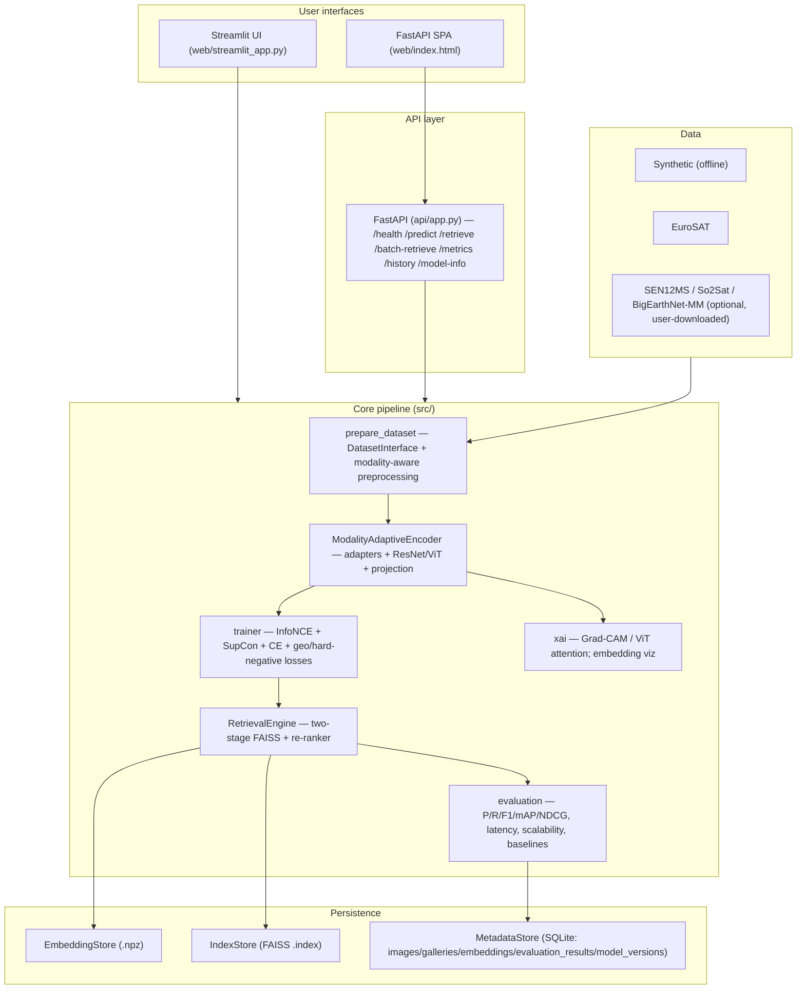
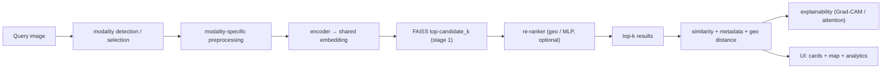
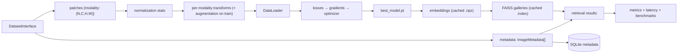
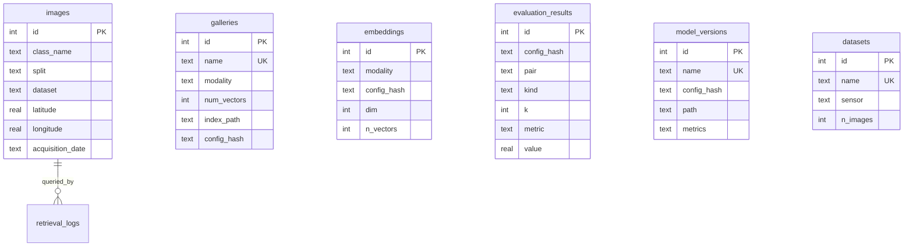
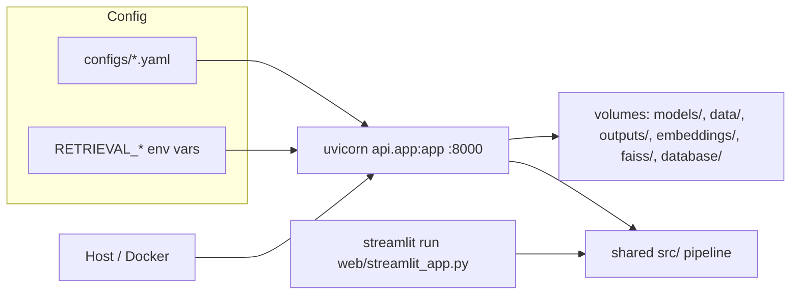
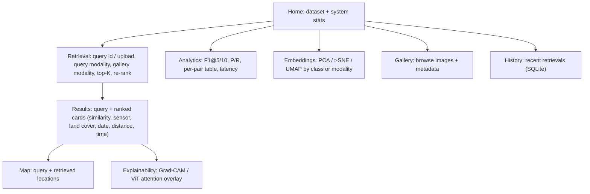

# System diagrams

Mermaid diagrams (render natively on GitHub). They reflect the actual
implementation, not a target.

## System architecture

## Retrieval pipeline

## Data-flow

## Database (ER)

## Deployment

## UI (Streamlit) wireframe

